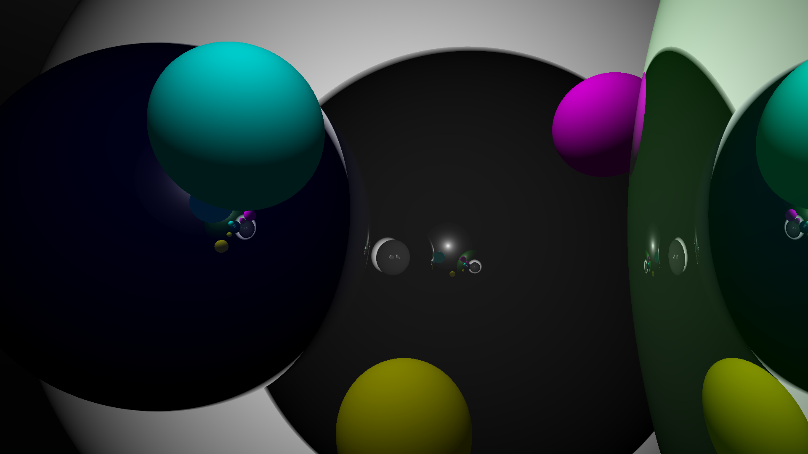

# go-raytracing

This is a simple demo I created while learning to use Go.

The library contains tools for rendering simple scenes with raytracing (on the CPU, but with some support for multiprocessing). The `examples` directory contains code for rendering the scenes below:

